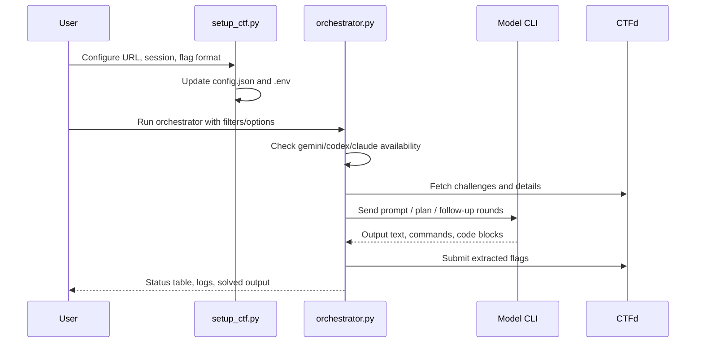

# Koshary Framework (v0.1 - Beta version)

```text
 _  _____  ____  _   _   _    ______   __
| |/ / _ \/ ___|| | | | / \  |  _ \ \ / /
| ' / | | \___ \| |_| |/ _ \ | |_) \ V /
| . \ |_| |___) |  _  / ___ \|  _ < | |
|_|\_\___/|____/|_| |_/_/   \_\_| \_\|_|
```

Autonomous CTFd solver framework for running Gemini, Codex, and optionally Claude through category-specific prompts, challenge workspaces, and parallel orchestration.

## Overview

Koshary is built around one main loop:

1. Set competition metadata and routing with `setup_ctf.py`
2. Start the solver with `orchestrator.py`
3. Inspect per-challenge workspaces under `challenges/`
4. Reset the framework safely with `clean_workspace.py`

## Visual Map

```mermaid
flowchart LR
    A[setup_ctf.py] --> B[config.json + .env]
    B --> C[orchestrator.py]
    C --> D[Model availability check]
    D --> E[Fetch CTFd challenges]
    E --> F[Route by category]
    F --> G[Create challenge workspace]
    G --> H[Plan]
    H --> I[Run model rounds]
    I --> J[Extract commands / code / flags]
    J --> K[Submit flag]
    K --> L[state/db.json + walkthroughs + artifacts]
```





## Features

| Capability | What it does |
| --- | --- |
| Startup model check | Detects `gemini`, `codex`, and `claude` before execution |
| Category routing | Maps challenge categories to model families through `config.json` |
| Alias-aware filters | `pwn` matches `Binary Exploitation`, `dfir` matches `Forensics`, etc. |
| Parallel solving | Runs multiple challenge workers concurrently |
| Planning mode | Generates a strategy pass before active solving |
| Artifact execution | Runs model-generated scripts inside the challenge workspace |
| Walkthrough mode | Asks agents to also produce `walkthrough.md` on success |
| State tracking | Stores solved IDs, submission history, stats, and challenge status |

## Project Layout

```text
CTF-AI/
├── orchestrator.py          Main solver and CTFd client
├── setup_ctf.py            Competition setup helper
├── clean_workspace.py      Workspace reset and secret scrubbing
├── first_blood.py          Early-flag polling utility
├── config.json             Routing, prompts, timeouts, workspace settings
├── .env                    CTFd session cookie
├── prompts/                Prompt templates by category
├── runners/                CLI wrappers for Gemini/Codex
├── challenges/             Per-challenge working directories
└── state/                  Persistent DB, logs, stats
```

Inside each challenge workspace:

```text
challenges/<id>-<slug>/
├── challenge.json
├── plan.md
├── submitted.json
├── walkthrough.md
├── files/
└── agent_rounds/
    ├── planning_prompt.txt
    ├── round_01.prompt.txt
    ├── round_01.out.txt
    ├── round_01.commands.txt
    ├── round_01.exec.txt
    └── round_01.artifact.py
```

## Requirements

- Python 3.10+
- `requests`
- Optional: `colorama`
- One or more installed model CLIs:
  - `gemini`
  - `codex`
  - `claude`
- Valid CTFd session cookie
- Optional Python virtualenv with CTF tooling such as `pwntools`, `pycryptodome`, `z3-solver`

## Quick Start

### 1. Review `config.json`

`config.json` controls:

- CTF metadata under `ctf`
- category-to-model routing under `routing`
- model runner commands under `models`
- workspace paths under `workspace`

Minimal areas you usually care about:

```json
{
  "ctf": {
    "base_url": "https://example.ctfd.io",
    "flag_patterns": ["myctf\\{[^\\s]+\\}"],
    "parallel_workers": 3
  },
  "routing": {
    "web": "gemini",
    "crypto": "codex",
    "pwn": "codex",
    "forensics": "gemini"
  }
}
```

### 2. Configure the project with `setup_ctf.py`

Recommended interactive flow:

```bash
python3 setup_ctf.py \
  --url https://ctf.example.com \
  --session 'session_cookie_value' \
  --flag 'MyCTF{}' \
  --interactive
```

What it does:

- writes `CTFD_SESSION=...` into `.env`
- updates `ctf.name`
- updates `ctf.base_url`
- converts the flag format into a regex and inserts it into `ctf.flag_patterns`
- optionally lets you assign category families to Gemini or Codex

Manual routing mode:

```bash
python3 setup_ctf.py \
  --url https://ctf.example.com \
  --session 'session_cookie_value' \
  --flag 'MyCTF{}' \
  --models 'web:G,crypto:C,pwn:C,forensics:G'
```

Routing codes:

- `G` = `gemini`
- `C` = `codex`

### 3. Run the orchestrator

Typical run:

```bash
python3 orchestrator.py \
  --categories "crypto,pwn,dfir" \
  --parallel 3 \
  --plan \
  --walkthrough \
  --venv ~/CTF-env
```

## Orchestrator Startup Behavior

Before solving, the orchestrator now:

1. loads `.env` and `config.json`
2. checks whether `gemini`, `codex`, and `claude` exist in `PATH`
3. prints which model CLIs are available
4. exits if none are available
5. warns when `config.json` routes a category to a model that is not installed

Example:

```text
[STEP] Checking available AI model CLIs...
[ OK ] Available model: gemini
[ OK ] Available model: codex
[INFO] Available models on this system: codex, gemini
```

## Category Filters

The `--categories` option supports aliases.

| Input filter | Matches |
| --- | --- |
| `pwn` | `Binary Exploitation`, `binary`, `pwn` |
| `dfir` | `Forensics`, `dfir` |
| `rev` | `Reverse`, `Reverse Engineering`, `rev` |
| `crypto` | `Cryptography`, `crypto` |
| `web` | `Web`, `Web Exploitation` |
| `misc` | `Misc`, `Miscellaneous` |
| `mobile` | `Android`, `Mobile` |

Examples:

```bash
python3 orchestrator.py --categories "pwn"
python3 orchestrator.py --categories "dfir,web"
python3 orchestrator.py --categories "crypto,rev"
```

## Orchestrator Options

### `--url`

Overrides `ctf.base_url` for the current run only.

```bash
python3 orchestrator.py --url https://other-ctf.example
```

### `--session`

Overrides the `CTFD_SESSION` value from `.env`.

```bash
python3 orchestrator.py --session 'new_cookie_here'
```

### `--categories`

Comma-separated include filter. Only matching categories are eligible for solving.

```bash
python3 orchestrator.py --categories "pwn,crypto"
```

### `--parallel`

Overrides `ctf.parallel_workers`.

```bash
python3 orchestrator.py --parallel 5
```

### `--flag-format`

Prepends a custom flag regex to the active `flag_patterns` list for the current run.

```bash
python3 orchestrator.py --flag-format 'utflag\{[^\s]+\}'
```

### `--venv`

Prepends a Python virtualenv `bin/` directory to `PATH` for generated artifacts and shell commands.

```bash
python3 orchestrator.py --venv ~/CTF-env
```

### `--plan`

Enables a planning round before active solving. This creates `plan.md` in each workspace.

```bash
python3 orchestrator.py --plan
```

### `--timeout`

Overrides the model timeout in seconds.

```bash
python3 orchestrator.py --timeout 600
```

### `--walkthrough`

Requests a `walkthrough.md` alongside the solution path when the model succeeds.

```bash
python3 orchestrator.py --walkthrough
```

## Common Workflows

### Solve only pwn challenges

```bash
python3 orchestrator.py --categories "pwn" --parallel 2 --plan --venv ~/CTF-env
```

### Solve forensics with walkthroughs

```bash
python3 orchestrator.py --categories "dfir" --parallel 3 --plan --walkthrough
```

### Override URL and session for a quick test

```bash
python3 orchestrator.py \
  --url https://test-ctf.example \
  --session 'cookie_here' \
  --categories "web"
```

## `first_blood.py`

This utility watches the CTFd API and tries to solve obvious intro or sanity-check challenges early.

Example:

```bash
python3 first_blood.py --flag 'MyCTF{welcome_2026}' --interval 2 --brute-first 15
```

Options:

- `--flag`: known override flag to brute through likely sanity challenges
- `--interval`: currently parsed but the script sleeps at a fixed short interval in practice
- `--brute-first`: fallback count for trying the override flag on the first N IDs

## Cleaning and Resetting

Use `clean_workspace.py` when you want to reuse the framework for another competition.

### Safe reset

```bash
python3 clean_workspace.py --yes
```

Default behavior now:

- removes generated workspaces and state
- removes `orchestrator.log`
- keeps `config.json` in place
- scrubs `ctf.name`
- scrubs `ctf.base_url`
- clears `ctf.flag_patterns`
- clears include/exclude category filters
- keeps `.env` in place but empties `CTFD_SESSION=`

### Preserve current config and session

```bash
python3 clean_workspace.py --keep-config --yes
```

### Dry-run cleanup

```bash
python3 clean_workspace.py --dry-run
```

### Keep prompts and runners

```bash
python3 clean_workspace.py --keep-prompts --keep-runners --yes
```

## Audit Notes

The current codebase was reviewed and updated for these project-level issues:

- startup model availability checks were added to `orchestrator.py`
- category alias filtering was fixed so `pwn` and `dfir` work as expected
- model-missing warnings were added for misconfigured category routes
- `clean_workspace.py` was fixed so it scrubs competition-specific values instead of deleting `config.json`
- `clean_model_output()` fallback in `orchestrator.py` was fixed to avoid a runtime `NameError`

## Practical Notes

- If a challenge directory already has a `.lock`, the orchestrator will skip it as `locked`
- `config.json` routing and `models` definitions must stay consistent
- `claude` is recognized by startup checks, but you need a matching `models["claude"]` entry if you route categories to it
- interrupting the process during active thread shutdown can still produce noisy Python exit output because workers are mid-run

## Example End-to-End Session

```bash
python3 setup_ctf.py \
  --url https://utctf.live \
  --session 'session_cookie' \
  --flag 'utflag{}' \
  --interactive

python3 orchestrator.py \
  --categories "crypto,pwn,dfir" \
  --parallel 3 \
  --plan \
  --walkthrough \
  --venv ~/CTF-env

python3 clean_workspace.py --yes
```

## Disclaimer

Use this framework only in authorized CTF environments and within competition rules. Automated solving, polling, and submission may be restricted in some events.
