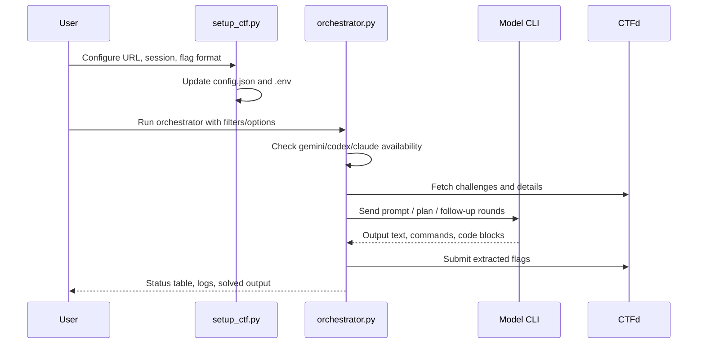

# Koshary Framework (v0.1 - Beta version)

```text
 _  _____  ____  _   _   _    ______   __
| |/ / _ \/ ___|| | | | / \  |  _ \ \ / /
| ' / | | \___ \| |_| |/ _ \ | |_) \ V /
| . \ |_| |___) |  _  / ___ \|  _ < | |
|_|\_\___/|____/|_| |_/_/   \_\_| \_\|_|
```

Autonomous **multi-platform** CTF solver framework for running Gemini, Codex, and optionally Claude through category-specific prompts, challenge workspaces, and parallel orchestration.

Koshary now supports three platforms behind a common adapter interface:

1. **CTFd** — classic CTFd-hosted competitions (cookie-based).
2. **Hack The Box CTF (MCP)** — via HTB's official **CTF MCP** server (token-based), including Docker instance spawning and Fullpwn machines.
3. **Hack The Box CTF (cookie/bearer)** — via the HTB web API with a captured browser session; works on events where MCP is disabled (`no_mcp`).

The orchestrator never talks to a platform directly. It only receives a
`NormalizedChallenge`, local files, target info, and a `submit_flag()` method, so
adding more platforms later is straightforward.

```text
Koshary Core
├── platforms/ctfd.py          (CTFd adapter)
├── platforms/htb_ctf_mcp.py   (HTB CTF MCP adapter)
└── platforms/htb_cookie.py    (HTB CTF cookie/bearer adapter)
```

## Overview

Koshary is built around one main loop:

1. Set competition metadata and routing with `setup_ctf.py` (CTFd), `setup_htb.py` (HTB MCP), or `setup_htb_cookie.py` (HTB cookie/bearer)
2. Start the solver with `orchestrator.py --platform ctfd|htb_ctf|htb_cookie`
3. Inspect per-challenge workspaces under `challenges/`
4. Reset the framework safely with `clean_workspace.py`

## Visual Map

```mermaid
flowchart LR
    A[setup_ctf.py] --> B[config.json + .env]
    B --> C[orchestrator.py]
    C --> D[Model availability check]
    D --> E[Fetch CTFd challenges]
    E --> F[Route by category]
    F --> G[Create challenge workspace]
    G --> H[Plan]
    H --> I[Run model rounds]
    I --> J[Extract commands / code / flags]
    J --> K[Submit flag]
    K --> L[state/db.json + walkthroughs + artifacts]
```





## Features

| Capability | What it does |
| --- | --- |
| Multi-platform | CTFd and Hack The Box CTF (official MCP) behind one adapter interface |
| HTB instances | Spawns/stops Docker instances, waits for reachability, handles Fullpwn machines |
| Secret redaction | `HTB_MCP_TOKEN`, session cookies, and Authorization headers are never logged |
| Startup model check | Detects `gemini`, `codex`, and `claude` before execution |
| Category routing | Maps challenge categories to model families through `config.json` |
| Alias-aware filters | `pwn` matches `Binary Exploitation`, `dfir` matches `Forensics`, etc. |
| Parallel solving | Runs multiple challenge workers concurrently |
| Planning mode | Generates a strategy pass before active solving |
| Artifact execution | Runs model-generated scripts inside the challenge workspace |
| Walkthrough mode | Asks agents to also produce `walkthrough.md` on success |
| State tracking | Stores solved IDs, submission history, stats, and challenge status |

## Project Layout

```text
Koshary/
├── orchestrator.py          Platform-agnostic solver loop + CLI
├── setup_ctf.py             CTFd setup helper
├── setup_htb.py             HTB CTF setup helper (MCP)
├── clean_workspace.py       Workspace reset and secret scrubbing
├── first_blood.py           Early-flag polling utility (CTFd)
├── config.json              platform, routing, htb block, models, workspace
├── .env                     CTFD_SESSION and/or HTB_MCP_TOKEN
├── platforms/               Platform adapters
│   ├── base.py              NormalizedChallenge, SubmitResult, BasePlatform
│   ├── ctfd.py              CTFd client + CTFdPlatform
│   └── htb_ctf_mcp.py       HTBCTFPlatform (tool discovery)
├── core/                    Platform-independent helpers
│   ├── mcp_client.py        MCP streamable-HTTP client (token redaction)
│   ├── flag_extractor.py    flag + non-standard candidate extraction
│   ├── downloads.py         download + archive extraction
│   ├── instance_manager.py  HTB instance lifecycle + reachability
│   └── logging_utils.py     redaction + structured stream loggers
├── prompts/                 Prompt templates (incl. htb_system.md, fullpwn.md)
├── runners/                 CLI wrappers for Gemini/Codex/Claude
├── tests/                   Unit tests + mocked HTB MCP fixtures
├── challenges/              Per-challenge working directories
├── logs/                    Structured logs (htb_mcp.log, ...)
└── state/                   Persistent DB, stats
```

Inside each challenge workspace:

```text
# CTFd:  challenges/<id>-<slug>/
# HTB:   challenges/<event>/<category>/<slug>/
├── challenge.json
├── target.json          (HTB target host/port/url + vpn_required)
├── instance.json        (HTB instance status, if spawned)
├── plan.md
├── submitted.json       ({"attempts": [...], "solved": bool})
├── walkthrough.md
├── files/               (+ ../extracted/ for archives)
└── agent_rounds/
    ├── planning_prompt.txt
    ├── round_01.prompt.txt
    ├── round_01.out.txt
    ├── round_01.commands.txt
    ├── round_01.exec.txt
    └── round_01.artifact.py
```

## Requirements

- Python 3.10+
- `requests`
- Optional: `colorama`
- One or more installed model CLIs:
  - `gemini`
  - `codex`
  - `claude`
- Valid CTFd session cookie
- Optional Python virtualenv with CTF tooling such as `pwntools`, `pycryptodome`, `z3-solver`

## Quick Start

### 1. Review `config.json`

`config.json` controls:

- CTF metadata under `ctf`
- category-to-model routing under `routing`
- model runner commands under `models`
- workspace paths under `workspace`

Minimal areas you usually care about:

```json
{
  "ctf": {
    "base_url": "https://example.ctfd.io",
    "flag_patterns": ["myctf\\{[^\\s]+\\}"],
    "parallel_workers": 3
  },
  "routing": {
    "web": "gemini",
    "crypto": "codex",
    "pwn": "codex",
    "forensics": "gemini"
  }
}
```

### 2. Configure the project with `setup_ctf.py`

Recommended interactive flow:

```bash
python3 setup_ctf.py \
  --url https://ctf.example.com \
  --session 'session_cookie_value' \
  --flag 'MyCTF{}' \
  --interactive
```

What it does:

- writes `CTFD_SESSION=...` into `.env`
- updates `ctf.name`
- updates `ctf.base_url`
- converts the flag format into a regex and inserts it into `ctf.flag_patterns`
- optionally lets you assign category families to Gemini or Codex

Manual routing mode:

```bash
python3 setup_ctf.py \
  --url https://ctf.example.com \
  --session 'session_cookie_value' \
  --flag 'MyCTF{}' \
  --models 'web:G,crypto:C,pwn:C,forensics:G'
```

Routing codes:

- `G` = `gemini`
- `C` = `codex`

### 3. Run the orchestrator

Typical run:

```bash
python3 orchestrator.py \
  --categories "crypto,pwn,dfir" \
  --parallel 3 \
  --plan \
  --walkthrough \
  --venv ~/CTF-env
```

## Orchestrator Startup Behavior

Before solving, the orchestrator now:

1. loads `.env` and `config.json`
2. checks whether `gemini`, `codex`, and `claude` exist in `PATH`
3. prints which model CLIs are available
4. exits if none are available
5. warns when `config.json` routes a category to a model that is not installed

Example:

```text
[STEP] Checking available AI model CLIs...
[ OK ] Available model: gemini
[ OK ] Available model: codex
[INFO] Available models on this system: codex, gemini
```

## Category Filters

The `--categories` option supports aliases.

| Input filter | Matches |
| --- | --- |
| `pwn` | `Binary Exploitation`, `binary`, `pwn` |
| `dfir` | `Forensics`, `dfir` |
| `rev` | `Reverse`, `Reverse Engineering`, `rev` |
| `crypto` | `Cryptography`, `crypto` |
| `web` | `Web`, `Web Exploitation` |
| `misc` | `Misc`, `Miscellaneous` |
| `mobile` | `Android`, `Mobile` |

Examples:

```bash
python3 orchestrator.py --categories "pwn"
python3 orchestrator.py --categories "dfir,web"
python3 orchestrator.py --categories "crypto,rev"
```

## Orchestrator Options

### `--url`

Overrides `ctf.base_url` for the current run only.

```bash
python3 orchestrator.py --url https://other-ctf.example
```

### `--session`

Overrides the `CTFD_SESSION` value from `.env`.

```bash
python3 orchestrator.py --session 'new_cookie_here'
```

### `--categories`

Comma-separated include filter. Only matching categories are eligible for solving.

```bash
python3 orchestrator.py --categories "pwn,crypto"
```

### `--parallel`

Overrides `ctf.parallel_workers`.

```bash
python3 orchestrator.py --parallel 5
```

### `--flag-format`

Prepends a custom flag regex to the active `flag_patterns` list for the current run.

```bash
python3 orchestrator.py --flag-format 'utflag\{[^\s]+\}'
```

### `--venv`

Prepends a Python virtualenv `bin/` directory to `PATH` for generated artifacts and shell commands.

```bash
python3 orchestrator.py --venv ~/CTF-env
```

### `--plan`

Enables a planning round before active solving. This creates `plan.md` in each workspace.

```bash
python3 orchestrator.py --plan
```

### `--timeout`

Overrides the model timeout in seconds.

```bash
python3 orchestrator.py --timeout 600
```

### `--walkthrough`

Requests a `walkthrough.md` alongside the solution path when the model succeeds.

```bash
python3 orchestrator.py --walkthrough
```

## Common Workflows

### Solve only pwn challenges

```bash
python3 orchestrator.py --categories "pwn" --parallel 2 --plan --venv ~/CTF-env
```

### Solve forensics with walkthroughs

```bash
python3 orchestrator.py --categories "dfir" --parallel 3 --plan --walkthrough
```

### Override URL and session for a quick test

```bash
python3 orchestrator.py \
  --url https://test-ctf.example \
  --session 'cookie_here' \
  --categories "web"
```

## HTB CTF Mode (Hack The Box)

Koshary can solve Hack The Box CTF events through HTB's official **CTF MCP**
server. Instance spawning (Docker) and Fullpwn machines are handled by the
framework; the AI models only ever solve inside scoped per-challenge workspaces.

### 1. Provide your HTB MCP token

Add it to `.env` (never logged — it is redacted everywhere):

```bash
HTB_MCP_TOKEN="paste_token_here"
```

or let the setup helper write it:

```bash
python3 setup_htb.py --token 'paste_token_here' --check-token
```

### 2. Configure an event

```bash
python3 setup_htb.py --list-events
python3 setup_htb.py --interactive
# or non-interactively:
python3 setup_htb.py --event cyber-apocalypse-2026 \
  --models 'web:C,crypto:C,pwn:C,rev:C,forensics:G,misc:G,fullpwn:C'
```

This sets `platform = "htb_ctf"`, writes `htb.event`, and adds the
`HTB{...}` / `CHTB{...}` flag patterns to `config.json`. `htb.event` accepts
either the numeric event id or the slug (e.g. `cyber-apocalypse-2026-1234`);
Koshary resolves the slug to the numeric `ctf_id` automatically.

### 2b. Join the event (required before challenges are visible)

HTB returns `403` for an event's challenges until your team has joined it.
Joining is a state-changing action, so it is explicit:

```bash
python3 setup_htb.py --event cyber-apocalypse-2026 --join          # uses your first team
python3 setup_htb.py --event cyber-apocalypse-2026 --join \
  --team-id 316647 --ctf-password 'optional-event-password'
```

Set `htb.auto_join: true` (and optionally `htb.team_id`) to join during setup
automatically.

### 3. List, sync, and solve

```bash
# List challenges for the event
python3 orchestrator.py --platform htb_ctf --event cyber-apocalypse-2026 --list-challenges

# Create local workspaces (and download attachments) without solving
python3 orchestrator.py --platform htb_ctf --event cyber-apocalypse-2026 --sync-only --download

# Solve only web (planning on, submission off for early testing)
python3 orchestrator.py \
  --platform htb_ctf \
  --event cyber-apocalypse-2026 \
  --categories web \
  --parallel 2 --plan --walkthrough --no-submit

# Fullpwn (serial by default; assumes your HTB VPN is connected)
python3 orchestrator.py \
  --platform htb_ctf --categories fullpwn \
  --parallel 1 --plan --walkthrough --venv ~/CTF-env
```

### HTB configuration (`config.json` → `htb`)

```json
{
  "platform": "htb_ctf",
  "htb": {
    "mcp_url": "https://mcp.hackthebox.ai/v1/ctf/mcp/",
    "event": "cyber-apocalypse-2026",
    "auto_start_instances": true,
    "auto_stop_on_solve": false,
    "download_password": "hackthebox",
    "max_wrong_submissions_per_challenge": 3,
    "allow_nonstandard_flags": false,
    "assume_vpn_connected": false,
    "tools": {}
  }
}
```

`tools` lets you pin exact MCP tool names per role (e.g.
`{"submit_flag": "submit_ctf_flag"}`) if HTB's auto-discovered names ever change;
otherwise Koshary discovers and matches them at runtime.

### HTB-specific orchestrator flags

| Flag | Effect |
| --- | --- |
| `--platform htb_ctf` | Select the HTB adapter (or set `platform` in config) |
| `--event SLUG` | Override `htb.event` |
| `--list-events` | List HTB events and exit |
| `--list-challenges` / `--sync-only` | Create local workspaces, then exit |
| `--download` | Download + extract attachments during sync |
| `--start-only` | Sync + spawn instances, then exit |
| `--no-auto-start` | Do not spawn Docker instances |
| `--auto-stop` | Stop the instance after a solve |
| `--no-submit` | Detect flags but never submit |
| `--manual-submit` | Print candidate flags instead of submitting |
| `--max-wrong N` | Cap wrong submissions per challenge (`0` = unlimited) |
| `--allow-nonstandard-flags` | Submit `FINAL_ANSWER_CANDIDATE` values (CVE, password, ...) |
| `--scoreboard` | Print the event scoreboard and exit |
| `--strategy` | Print a ranked solve queue and exit |

## HTB CTF Mode — Cookie/Bearer (`htb_cookie`)

A second HTB adapter drives the same JSON API the HTB CTF **web app** uses
(`https://ctf.hackthebox.com/api/...`), authenticated with a captured browser
session instead of an MCP token. Use this for events where MCP is disabled
(`mcp_access_mode = no_mcp`, e.g. *CTF Try Out* / event `1434`).

> ⚠️ This mode replays your live HTB session. Use only for events you are
> authorized to access. **Never commit** the cookie/bearer or capture files —
> `.env`, `htb_headers.txt`, `*.headers`, `burp_*.xml`, and `htb_requests` are
> gitignored.

### 1. Provide your session (Cookie + Bearer)

Every captured HTB API request carries **both** a `Cookie` and an
`Authorization: Bearer`, so the default `auth_mode` is `cookie_bearer`. Supply
them one of two ways:

```bash
# A) Environment (.env)
HTB_CTF_COOKIE='full Cookie header value'
HTB_CTF_BEARER='Bearer token value (with or without the "Bearer " prefix)'
HTB_CTF_USER_AGENT='your browser user agent'   # optional

# B) From a captured request / Burp export -> gitignored htb_headers.txt
python3 tools/import_burp_headers.py -i htb_requests -o htb_headers.txt
```

`tools/import_burp_headers.py` decodes a Burp XML export (or a raw request),
writes only `Cookie` / `Authorization` / `User-Agent` to a `0600` file, and
prints **header names only** — never the values.

### 2. Configure + validate the event

```bash
python3 setup_htb_cookie.py --ctf-id 1434 --headers-file htb_headers.txt --check
python3 setup_htb_cookie.py --ctf-id 1434 --headers-file htb_headers.txt --list
python3 setup_htb_cookie.py --ctf-id 1434 --models 'web:G,crypto:L,pwn:C,rev:L'
```

`--check` calls `GET /api/ctfs/{id}/menu` and confirms `userCanViewChallenges`
is true (a `403` means you have not joined the event in the browser yet; a `401`
means the cookie/bearer expired — re-capture them).

### 3. List, download, start, solve

```bash
# List challenges
python3 orchestrator.py --platform htb_cookie --ctf-id 1434 --list-challenges

# Download + extract all attachments, no solving
python3 orchestrator.py --platform htb_cookie --ctf-id 1434 --download --sync-only

# Start one Docker challenge and write its target.json
python3 orchestrator.py --platform htb_cookie --ctf-id 1434 --challenge-id 31856 --start-only

# Solve web challenges, planning on, submission off (early testing)
python3 orchestrator.py --platform htb_cookie --ctf-id 1434 --categories web --plan --no-submit

# Solve + submit
python3 orchestrator.py --platform htb_cookie --ctf-id 1434 --categories web,crypto,pwn --parallel 3 --plan

# Submit / stop one challenge manually
python3 orchestrator.py --platform htb_cookie --ctf-id 1434 --challenge-id 40742 --submit-candidate 'HTB{...}'
python3 orchestrator.py --platform htb_cookie --ctf-id 1434 --challenge-id 40742 --stop-instance
```

### Cookie-mode configuration (`config.json` → `htb_cookie`)

| Key | Meaning |
| --- | --- |
| `base_url` | `https://ctf.hackthebox.com` |
| `ctf_id` | Numeric event id (e.g. `1434`) |
| `auth_mode` | `cookie_bearer` (default), `cookie_only`, or `bearer_only` |
| `auto_start_instances` | Auto-spawn Docker containers (default `true`) |
| `auto_start_fullpwn` | Auto-spawn Fullpwn machines (default `false`; VPN-bound) |
| `auto_stop_on_solve` | Stop the container after a solve (default `false`) |
| `download_password` | Archive password tried after passwordless (`hackthebox`) |
| `max_wrong_submissions_per_challenge` | Wrong-submission cap (default `3`) |
| `poll_seconds` / `poll_interval` | Container-ready polling window |

Workspaces are written under `challenges/htb_cookie/<ctf_id>/<category>/<id>_<slug>/`.

### Tests

```bash
python3 -m unittest discover -s tests -p "test_*.py"
```

All HTB tests use mocked fixtures — MCP mode under `tests/fixtures/htb/` and
cookie/bearer mode under `tests/fixtures/htb_cookie/` (with a no-network fake
session). No network, token, or session is required.

## `first_blood.py`

This utility watches the CTFd API and tries to solve obvious intro or sanity-check challenges early.

Example:

```bash
python3 first_blood.py --flag 'MyCTF{welcome_2026}' --interval 2 --brute-first 15
```

Options:

- `--flag`: known override flag to brute through likely sanity challenges
- `--interval`: currently parsed but the script sleeps at a fixed short interval in practice
- `--brute-first`: fallback count for trying the override flag on the first N IDs

## Cleaning and Resetting

Use `clean_workspace.py` when you want to reuse the framework for another competition.

### Safe reset

```bash
python3 clean_workspace.py --yes
```

Default behavior now:

- removes generated workspaces and state
- removes `orchestrator.log`
- keeps `config.json` in place
- scrubs `ctf.name`
- scrubs `ctf.base_url`
- clears `ctf.flag_patterns`
- clears include/exclude category filters
- keeps `.env` in place but empties `CTFD_SESSION=`

### Preserve current config and session

```bash
python3 clean_workspace.py --keep-config --yes
```

### Dry-run cleanup

```bash
python3 clean_workspace.py --dry-run
```

### Keep prompts and runners

```bash
python3 clean_workspace.py --keep-prompts --keep-runners --yes
```

### HTB-aware cleanup

```bash
# Stop any tracked HTB instances (via MCP) before deleting state
python3 clean_workspace.py --stop-running-instances --yes

# Keep the HTB token value when scrubbing .env
python3 clean_workspace.py --keep-htb-token --yes
```

HTB cleanup also empties `htb.event` and the `HTB_MCP_TOKEN` value (key kept)
while preserving routing and HTB connection settings.

## Audit Notes

The current codebase was reviewed and updated for these project-level issues:

- startup model availability checks were added to `orchestrator.py`
- category alias filtering was fixed so `pwn` and `dfir` work as expected
- model-missing warnings were added for misconfigured category routes
- `clean_workspace.py` was fixed so it scrubs competition-specific values instead of deleting `config.json`
- `clean_model_output()` fallback in `orchestrator.py` was fixed to avoid a runtime `NameError`

## Practical Notes

- If a challenge directory already has a `.lock`, the orchestrator will skip it as `locked`
- `config.json` routing and `models` definitions must stay consistent
- `claude` is recognized by startup checks, but you need a matching `models["claude"]` entry if you route categories to it
- interrupting the process during active thread shutdown can still produce noisy Python exit output because workers are mid-run

## Example End-to-End Session

```bash
python3 setup_ctf.py \
  --url https://utctf.live \
  --session 'session_cookie' \
  --flag 'utflag{}' \
  --interactive

python3 orchestrator.py \
  --categories "crypto,pwn,dfir" \
  --parallel 3 \
  --plan \
  --walkthrough \
  --venv ~/CTF-env

python3 clean_workspace.py --yes
```

## Disclaimer

Use this framework only in authorized CTF environments and within competition rules. Automated solving, polling, and submission may be restricted in some events.
